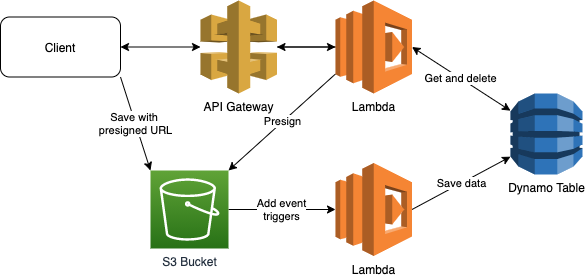

# What's here?

- Get presigned S3 url from Lambda
- Save JSON to S3 with the presigned url
- S3 save triggers lambda that removes file from S3 and saves content to DynamoDB
- Get data via REST Api from DynamoDB



## Commands

```bash
npm run init # After clone init all 3rd parties
npm run build # Build application
npm run deploy # Deploy CloudFormation stack
npm run demo # Get presigned url, save file, wait 10 s, get data
npm run destroy # Destroy CloudFormation stack
npm run clean # Clear all local files (build, cdk data, node_modules)
```

Or run all

```bash
npm run all
```
