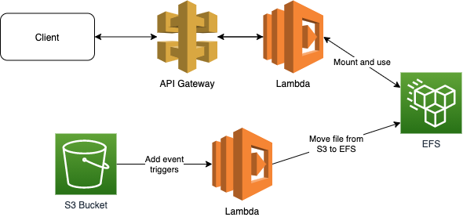

# What's here?

Add files to S3, there are copied to EFS, fetch these files from Lambda or fetch all files that were added to EFS (to mounted dir).



## Commands

```bash
npm run init # After clone init all 3rd parties (note, typically you want to build your lambda's to different directory in build phase, then run tests and finally deploy)
npm run deploy # Deploy CloudFormation stack
npm run upload-demo-file # upload some files to bucket with AWS CLI
npm run demo # Run a demo
npm run empty-bucket # empty bucket
npm run destroy # Destroy CloudFormation stack (empties also bucket if there are some files)
npm run clean # Clear all local files (build, cdk data, node_modules)
```

Or run all

```bash
npm run all
```
