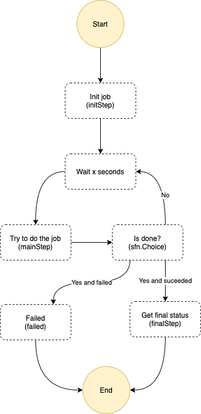

# What's here?

Let's learn step functions here and create a small state machine.

Execute this state machine from AWS by searching for the state machine in the cloud formation stack you have created.



This state machine will fail with probability 50%. New loop is started with probability that is given in the input to initialization (or if not given by 50%). You may give this when you execute the state machine from the console with json

```bash
{
    "prob": 0.25
}
```

This would mean that there is 75% chance thet job is not done when executing task in the main loop.

## Commands

```bash
npm run init # After clone init all 3rd parties
npm run deploy # Deploy CloudFormation stack
npm run destroy # Destroy CloudFormation stack (empties also bucket if there are some files)
npm run clean # Clear all local files
```
