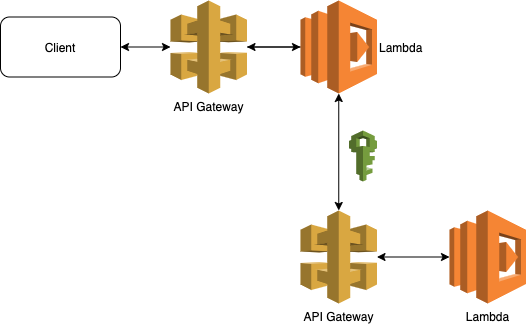

# What's here?

This creates two Lambdas and not in a way how you would do them in production - especially in continuous delivery deployments. Demo sends get request to the first (created in stack 1), which forwards it to the second (created in stack 2) using IAM role as authenticator and returns the message.



## Commands

```bash
npm run init # After clone init all 3rd parties
npm run build # Build application
npm run deploy1 # Deploy CloudFormation stack 1
npm run deploy2 # Deploy CloudFormation stack 2 (should be deployed before 1)
npm run deploy # Deploy CloudFormation stacks
npm run demo # Make http request to lambda1 that calls lambda2 as well as directly to lambda2. The second request will fail because missing auth.
npm run destroy # Destroy CloudFormation stacks
npm run clean # Clear all local files (build, cdk data, node_modules)
```

Or run all

```bash
npm run all
```
