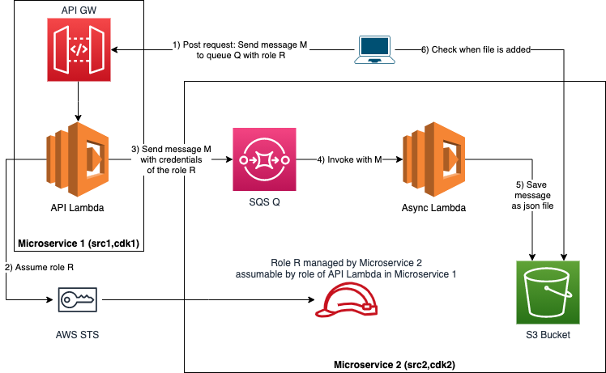

# What's here?

This creates two lambdas, one after REST API gateway and one after SQS. When the lambda behind the gateway is called gateway it'll send SQS message which triggers other lambda that saves the message to S3. These form two microservices: 1 for lambda behind the gateway and 2 for SQS, lambda and S3 bucket.

The interesting thing is that the microservice 1 is completely unaware of the microservice 2. Microservice 1 is invoked with a request including three things

* Role ARN that must be assumed when message is sent to SQS 
* URL of SQS
* Message to be sent

In a real use case the ARN and URL of SQS might come from parameter store from other persistent storage.

Microservice 1 is able to assume the role (that is granted by microservice 2 and policy given to lambda in microservice 1 that allows assuming roles in general).



## Commands

```bash
npm run init # After clone init all 3rd parties
npm run build # Build applications
npm run deploy # Deploy CloudFormation stacks
npm run demo # Make http request to rest lambda
npm run destroy # Destroy CloudFormation stacks
```

Or run init, build, test, deploy, demo

```bash
npm run all
```
