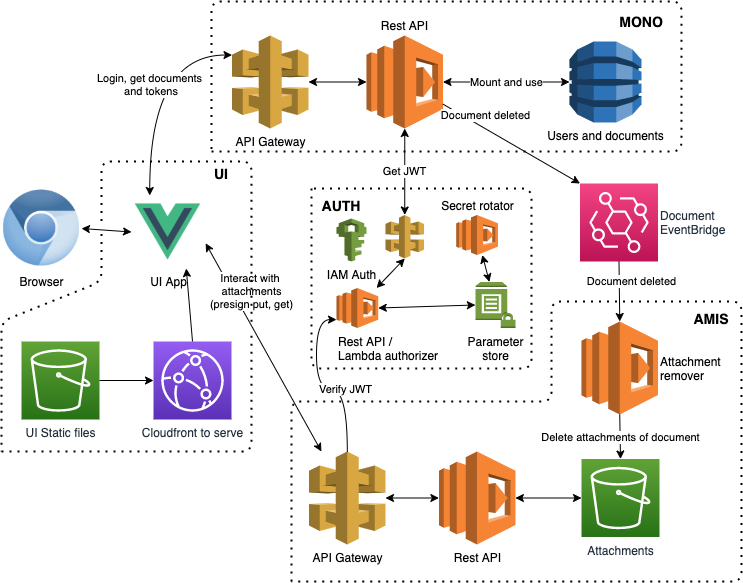

# What's here?

This demo includes

- Lambda which _represents_ a _monolithic backend_ (or perhaps just another microservice) which takes care of _user permissions_ and _manages documents_ (mono)
- Lambda, a real _microservice_, which _manages attachments of any documents_ (amis)
  - Get, delete and update via REST api calls
  - Delete from EventBridge event
- Lambda which acts as monolith to microservices integrator to perform tasks that would have been done in transaction if all the microservices were part of the monolith. For example, this pushes to correct queues messages that document has been deleted. (Integrator)
- Lambda with three purposes (auth)
  - JWT authorizer for microservices' API gateway
  - Create JWT token for monolith based to be passed permissions and other data
  - Change salt for signing JWT
- Graphical user interface to try the thing with browser (ui)

To get started add a key ´/Key/AmisAuth/Secret´ to parameter store. Add a uuid to value.



## Commands

###

So many commands in package.json, look

### For Python virtual environment

```bash
python3 -m venv ./venv # Create python virtual env
source venv/bin/activate # Activate virtual env
pip3 install -r src/auth/requirements.txt # Install dependencies that are only needed in local env
pip3 install -r src/auth/requirements.aws.txt # Install other dependencies
deactivate # Stop virtual env
cd src/auth; uvicorn main:app --reload --port 6108 # Start auth api
```

## Prerequisites

- Docker installed

Netcore Lambdas are based on

```bash
dotnet new -i "Amazon.Lambda.Templates::*"
dotnet new lambda --list
dotnet new serverless.AspNetCoreWebAPI
```
