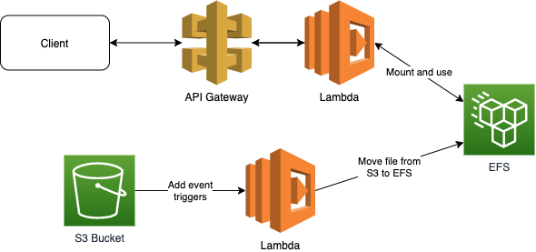

# What's here?

This creates lambda that is attached to EFS and another....



## Commands

```bash
npm run init # After clone init all 3rd parties
npm run build # Build application
npm run deploy # Deploy CloudFormation stack
npm run demo # save file to S3, get file content from, delete file from
npm run destroy # Destroy CloudFormation stack
npm run clear # Clear all local files (build, cdk data, node_modules)
```

Or run all

```bash
npm run all
```
