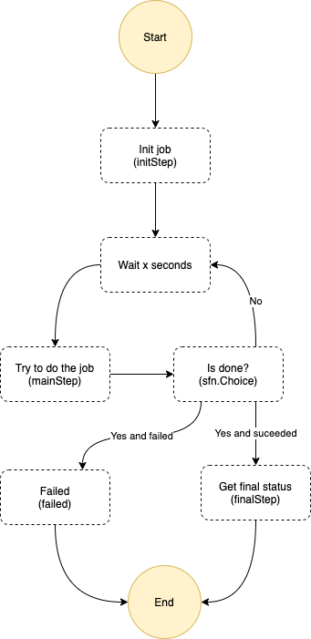

# What's here?

Let's learn step functions here and create a small state machine

Execute this state machine from AWS by looking for state machine in the cloud formation stack you have created.



This state machine will fail with probability 50%. New loop is started with probability that is given in the input to initialization (or if not given by 50%). You may give this when you execute the state machine from the console with json

```bash
{
    "prob": 0.25
}
```

This would mean that there is 75% chance thet job is not done when we are in the main loop.
