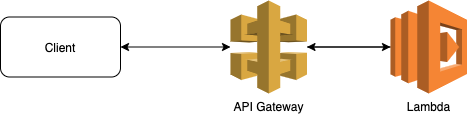

# What's here?

Add custom domain name to lambda.
To make this work you need to manually do in console following things before you can execute the stack.

- Have domain name, either in AWS or elsewhere. Let's assume this is `example.com`.
- Create hosted zone to Route53.
- If your domain name is elsewhere you need to set nameservers of your hosted zone to it in external service, if your domain name is in AWS, it should be in in this hosted zone and already have correct nameserves set.
- Add to Parameter Store variable `/HostedZone/MyZone` with value of the id of your hosted zone.
- Create in Certificate manager wildcard certificate to `\*.example.com`.
- Add to Parameter Store variable `/Certificate/MyDomainArn` having as value the ARN of the certificate you just created.
- Add to Parameter Store variable `/HostedZone/Domain` with value `example.com`.



# Commands

```bash
npm run init # After clone init all 3rd parties
npm run build # Build application
npm run deploy # Deploy CloudFormation stack
npm run demo # Make http request to lambda (via api gw) and display response
npm run destroy # Destroy CloudFormation stack
npm run clean # Clear all local files (build, cdk data, node_modules)
```

Or run all

```bash
npm run all
```
