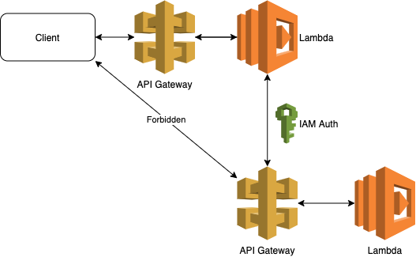

# What's here?

This creates two lambdas. Demo sends get request to the first (created in stack 1), which forwards it to the second (created in stack 2) using iam role as authenticator and returns the message.



## Commands

```bash
npm run init # After clone init all 3rd parties
npm run build # Build application
npm run deploy1 # Deploy CloudFormation stack 1
npm run deploy2 # Deploy CloudFormation stack 2
npm run deploy # Deploy CloudFormation stacks
npm run firstdeploy # First deployment requires three deploys to get urls right
npm run demo # Make http request to lambda1 that calls lambda2 as well as directly to lambda2. The second request will fail because missing auth.
npm run destroy # Destroy CloudFormation stacks
npm run clean # Clear all local files (build, cdk data, node_modules)
```

Or run init, build, test, deploy, demo

```bash
npm run all
```

Stack destroy can't be executed with cdk destroy because other stack ads role that is related to other. However, that could be done by deleting the role with cdk. This is not implemented so far.
